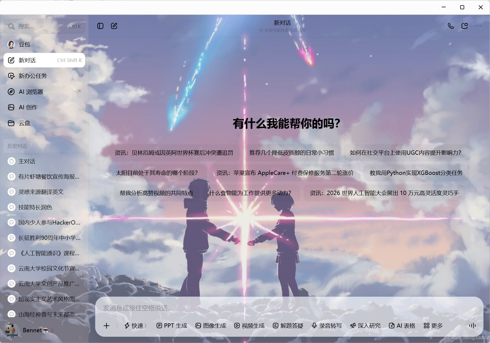
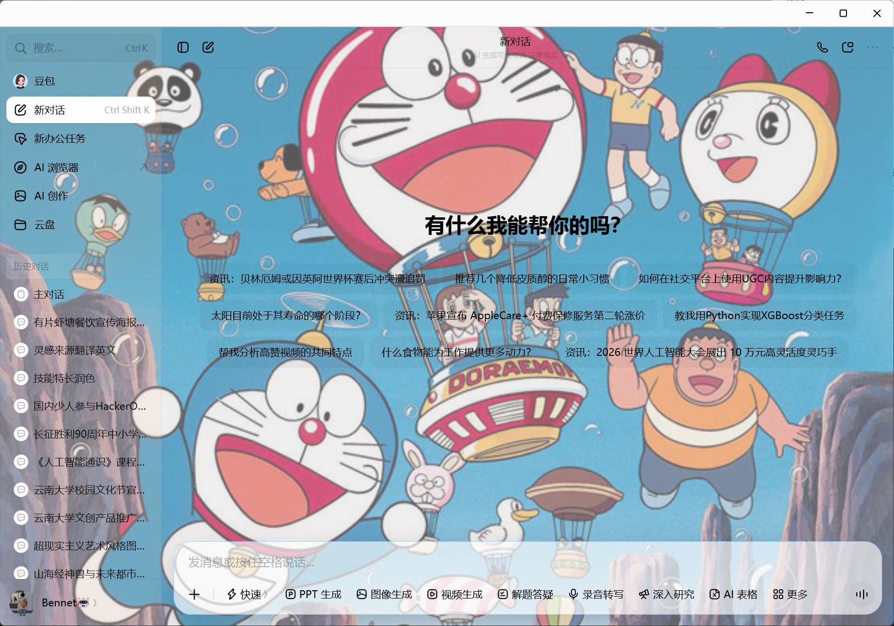
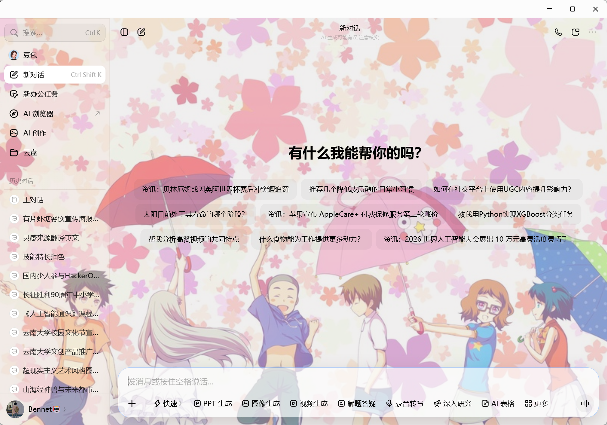
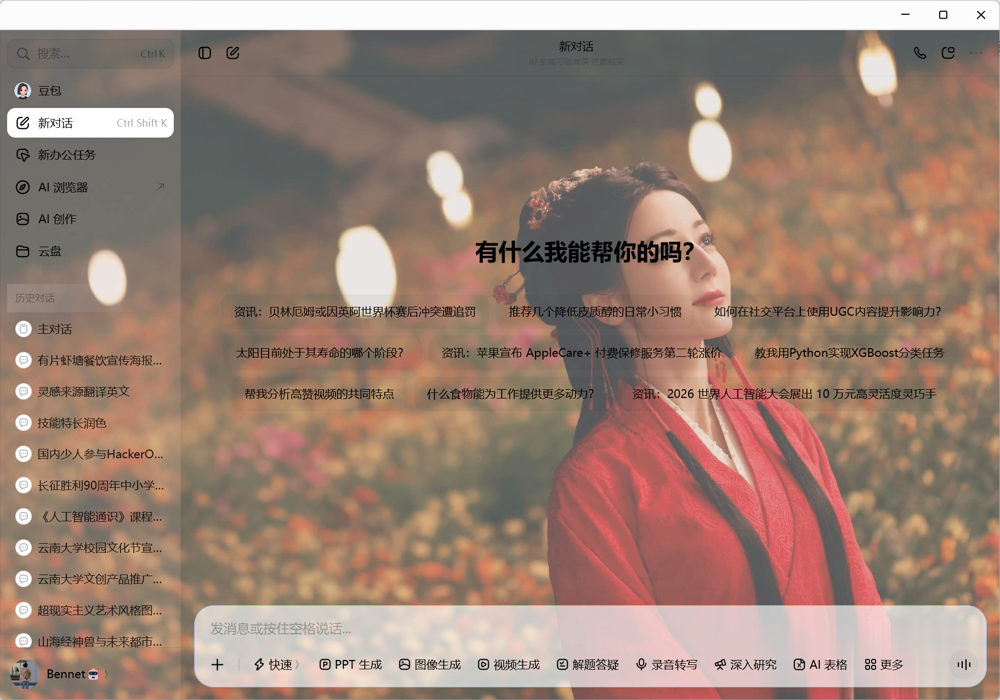
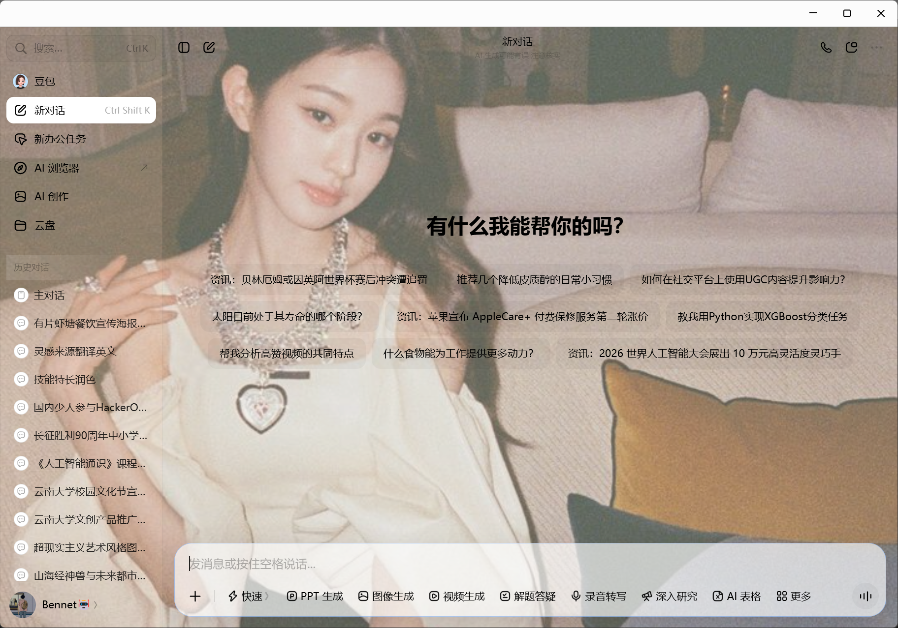
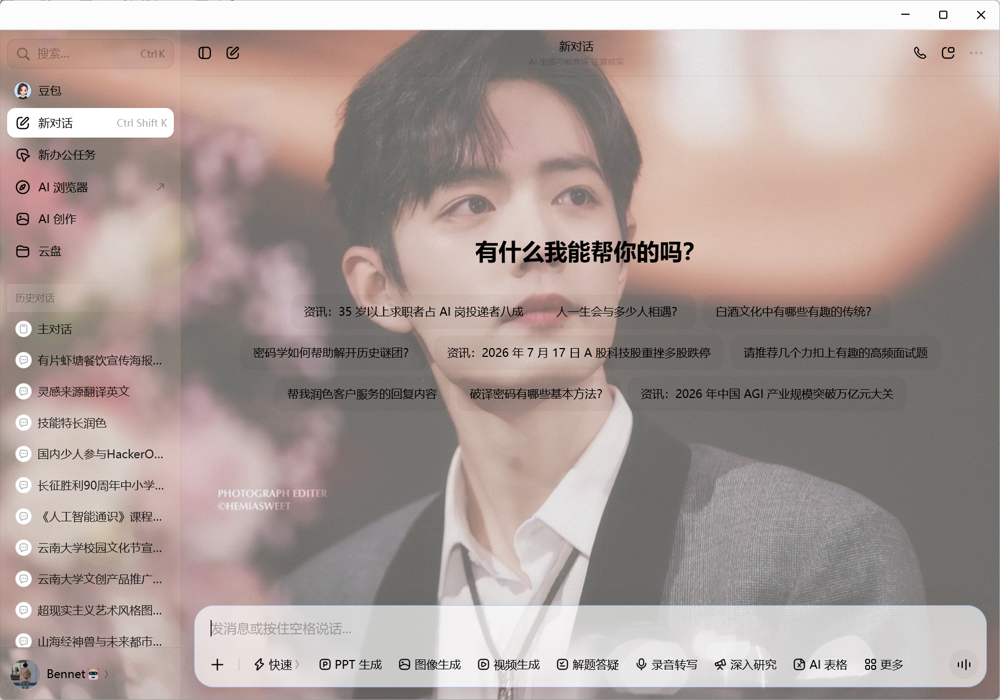
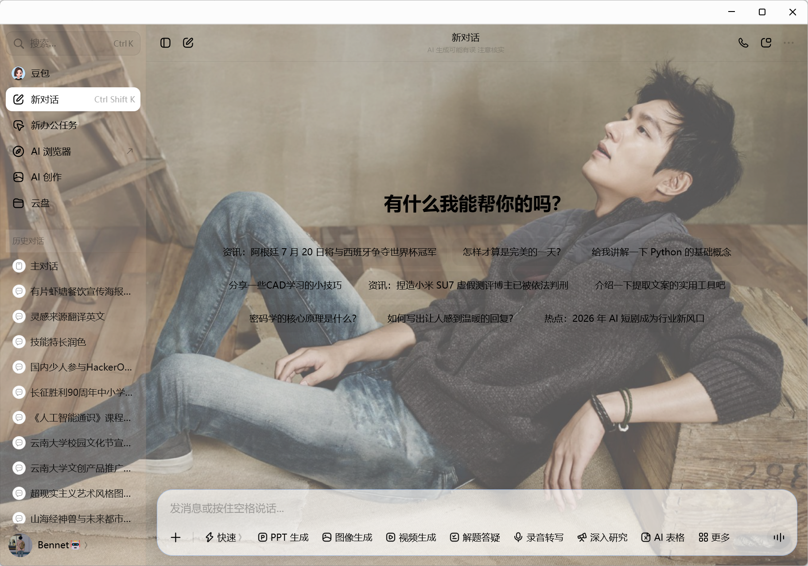
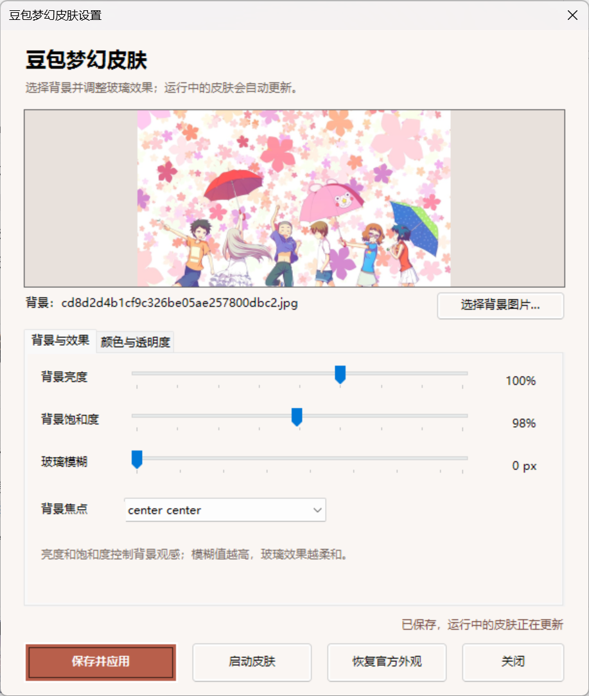
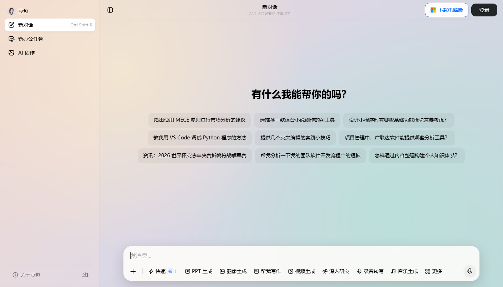
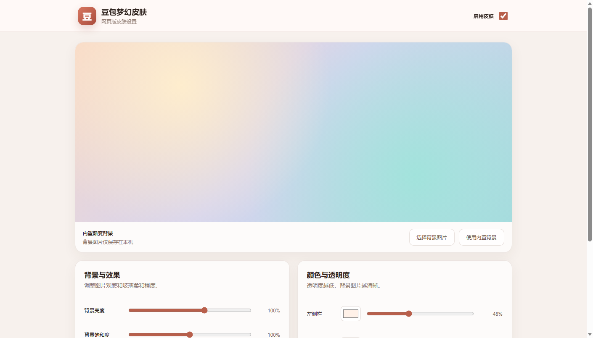

# DouBao Dream Skin / 豆包梦幻皮肤

一个同时支持网页版和 Windows 桌面版豆包的可恢复换肤工具。网页版通过 Chrome / Edge 扩展运行，桌面版通过豆包自带的 Chromium 调试接口运行；两种方式都不会修改豆包程序文件。

## 效果预览

只需替换一张背景图片，即可在不同风格之间快速切换；侧栏、内容区和输入框会保留可调节的玻璃透明效果。



<details>
<summary><strong>展开查看更多主题效果</strong></summary>

<br>

<table>
  <tr>
    <td width="50%"></td>
    <td width="50%"></td>
  </tr>
  <tr>
    <td></td>
    <td></td>
  </tr>
  <tr>
    <td></td>
    <td></td>
  </tr>
</table>

</details>

### 图形化设置

无需手动编辑配置文件，可直接选择图片，并调整亮度、饱和度、模糊、焦点、区域颜色与透明度。

<p align="center">
  
</p>

> 示例中的背景素材仅用于展示换肤效果，相关版权归原作者或原权利人所有。请使用自己拥有授权的图片。

## 功能

- 支持网页版豆包的 Chrome / Edge 浏览器扩展
- 支持 Windows 豆包桌面版启动器
- 图形化选择本地 JPG、PNG 或 WebP 背景
- 调整背景亮度、饱和度、玻璃模糊和背景焦点
- 分别设置左侧栏、主区域和输入框的颜色与透明度
- 页面刷新或跳转后自动重新应用，配置保存后热更新
- 一键启动皮肤、一键恢复官方外观
- 调试接口仅绑定 `127.0.0.1`
- 不替换、不破解、不重新打包豆包程序文件

## 浏览器版安装（推荐）

浏览器版无需安装 Node.js，同一份扩展同时支持 Chrome 和 Microsoft Edge。

1. 下载并解压整个项目。
2. Chrome 打开 `chrome://extensions/`；Edge 打开 `edge://extensions/`。
3. 打开“开发者模式”或“开发人员模式”。
4. 点击“加载已解压的扩展程序”，选择项目中的 `browser-extension` 文件夹。
5. 打开 [网页版豆包](https://www.doubao.com/chat/)，点击扩展图标即可启用或自定义皮肤。

<table>
  <tr>
    <td width="50%"></td>
    <td width="50%"></td>
  </tr>
  <tr>
    <td align="center">网页版实际效果</td>
    <td align="center">浏览器扩展设置</td>
  </tr>
</table>

详细步骤和权限说明请查看 [浏览器扩展使用说明](browser-extension/README.md)。

## 桌面版环境要求

- Windows 10 或 Windows 11
- 豆包 Windows 桌面版
- Node.js 14.18 或更高版本

## 桌面版快速开始

1. 点击 GitHub 页面右上方的 **Code → Download ZIP**，解压到一个长期保留的目录。
2. 双击 `皮肤设置.cmd`。
3. 在“背景与效果”“颜色与透明度”两个页面中调整参数，点击“保存并应用”。
4. 豆包正在运行且尚未启用皮肤时，按提示允许重启一次。

工具会尝试从正在运行的进程、卸载信息和常见目录中寻找豆包。如果没有找到，请打开自动生成的 `config\app.json`，填写实际安装根目录：

```json
{
  "doubaoInstallRoot": "D:\\doubao",
  "preferredPort": 9336,
  "stateDirectoryName": "DoubaoDreamSkin"
}
```

## 桌面版常用入口

- `皮肤设置.cmd`：选择背景并调整玻璃效果
- `启动豆包皮肤.cmd`：使用上次保存的主题启动
- `恢复豆包外观.cmd`：移除皮肤并关闭调试会话
- `安装桌面快捷方式.cmd`：创建设置、启动和恢复快捷方式
- `验证并截图.cmd`：检查运行状态，在本机保存预览图

用户选择的背景、个人配置、运行日志和验证截图都已加入忽略规则，不会被正常的 Git 提交上传。

## 工作原理与安全边界

浏览器扩展只在 `doubao.com` 上运行，通过浏览器本地存储保存主题和背景，不上传图片或聊天内容。桌面版启动器会用仅限本机访问的调试端口启动豆包，随后把背景和 CSS 样式注入豆包页面；恢复功能会结束注入器并正常重启豆包，从而关闭调试端口。

- 浏览器扩展不包含远程代码，网站权限仅限豆包域名。
- 调试接口不会开放给局域网，但皮肤运行期间，本机其他程序理论上可以访问它，请只运行可信软件。
- 豆包更新后页面结构可能变化，需要重新验证并适配选择器。
- 本项目与字节跳动、豆包官方无隶属或授权关系；“豆包”及相关标识归其权利人所有。

## 主题参数

首次运行会从 `config\theme.example.json` 生成本地 `config\theme.json`。设置窗口已经开放以下常用参数；需要输入精确数值时，也可以手动编辑该文件：

- `backgroundPosition`：背景焦点
- `backgroundBrightness`：背景亮度
- `backgroundSaturation`：背景饱和度
- `sidebarColor`：左侧栏颜色和透明度
- `surfaceColor`：主区域颜色和透明度
- `composerColor`：输入框颜色和透明度
- `blurPixels`：玻璃模糊半径

背景文件上限为 16 MB。

## 开发检查

项目不依赖第三方 npm 包：

```powershell
npm run check
```

## 开源许可

本项目使用 [MIT License](LICENSE)。欢迎提交 Issue 和 Pull Request。
